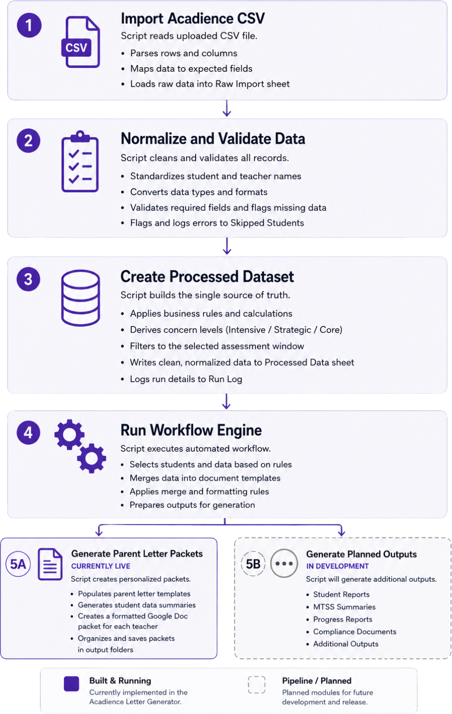
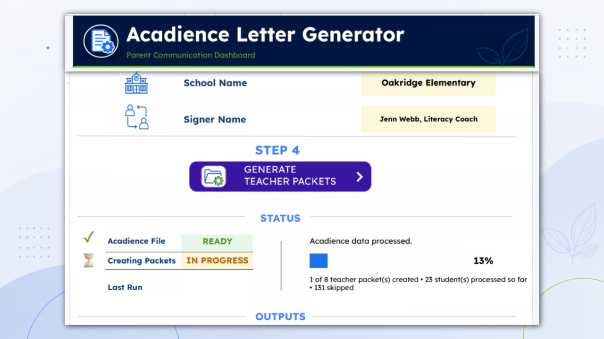
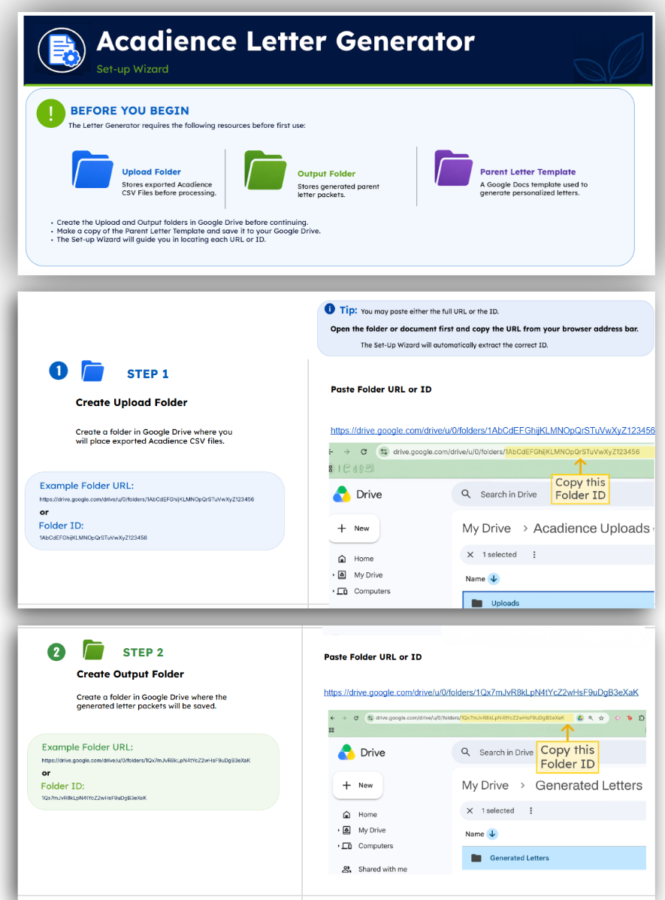
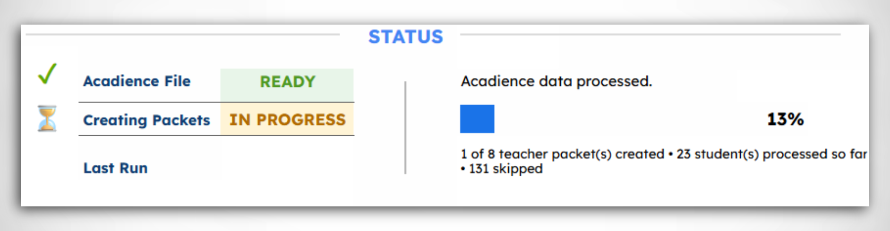

# Acadience Letter Generator

**A one-click workflow engine that turns benchmark assessment data into formatted parent-letter packets for every teacher in a building — automatically.**

---

*Figure 1. Workflow architecture showing how benchmark assessment data moves from import through processing to automated teacher packet generation.*

---

## Introduction

This case study documents the evolution of a manual benchmark assessment process into an automated workflow system. What began as an attempt to simplify a repetitive task ultimately became a reusable workflow engine designed to improve reliability, reduce manual effort, and give educators more time to focus on students.

## The Problem

Three times a year, every elementary school in my district administers benchmark assessments in reading and math. Afterward, each teacher needs a packet of parent letters — one per student — so families can see how that child performed against grade-level expectations.

This wasn't my job. It belonged to two colleagues — a reading specialist and a math specialist — and I watched it cost them days of work during every benchmark window. They were frustrated, partly because the rest of the staff didn't really see what it took to produce those packets: going through printed reports, filling everything in by hand, and assembling a separate packet of letters for every class. It was slow, repetitive, and easy to get wrong.

I was friends with both of them. When one described just how long it took to get through it all, I decided I wanted to help — to give them their time back so they could spend it on students instead of formatting, and to give my classroom teacher friends more time to teach as well. So I set out to get the assessment data into a spreadsheet and run a mail merge. That was the seed of the whole project.

The manual process was also fragile in a way that mattered. Done by hand or by basic mail merge, it was easy to:

- forget to update the template for the correct benchmark window (Beginning, Middle, or End of Year) — which meant letters that said the wrong thing
- lose the template and have to rebuild it from scratch
- have to reconnect the mail-merge fields every single time
- have to convert the output into a format that could be emailed, opened, and printed by the teacher who needed it

## Why This Was Worth Solving

This wasn't only about saving time. It was about consistency and trust. Parent communication should be accurate every time, regardless of who is generating it or how rushed they are. A process that depends on remembering to change a setting is a process that will eventually send the wrong letter.

I wanted to remove that entire category of error — not just make the task faster, but make it reliable — and give two overworked colleagues back days they could spend on the work only they could do.

## What I Built

I built an assessment operations dashboard in Google Sheets and Apps Script. It is often described as a "letter generator," but that undersells it: letters are just the current output. The underlying system is a workflow engine.

A teacher exports their benchmark data, drops the file in a folder, and clicks one button. The system imports the newest file, normalizes it, filters to the selected assessment window, groups students by teacher, and generates a formatted Google Doc packet for each teacher — automatically applying the correct window, template, and formatting every time, so teachers get the right packets without manual setup.

*Figure 2. The Parent Communication Dashboard — a single button triggers the full workflow, with live status and progress visible below.*

I also made a deliberate design choice about the interface. Rather than accept that a Google Sheet "looks like a spreadsheet," I built it to behave like an internal business application — a guided control panel with numbered steps, live status indicators, a progress bar, setup validation, and a built-in setup wizard and instructions page so a non-technical user can run it without help.

*Figure 3. A guided setup wizard replaces manual configuration with a step-by-step onboarding experience, validating required resources before packet generation.*

## A Real Technical Challenge

Google Apps Script caps a single execution at roughly six minutes on standard accounts. (Workspace accounts get a longer window — but I deliberately built for the shorter limit, so the tool would run anywhere, on any account, without depending on a particular tier.) A full building's worth of letters takes longer than six minutes to generate, so a naive version would simply stop partway through.

I designed around the constraint rather than against it, building a self-continuing relay: the workflow processes as many teacher packets as it can within a safe time budget, then automatically schedules its own continuation and resumes where it left off until every packet is complete. Progress is tracked in the data itself, so the system always knows what's done and what remains — which also means it can recover if anything interrupts it mid-run.

*Figure 4. Processing dashboard showing packet generation in progress — 1 of 8 teacher packets created, 13% complete.*

This transformed the experience from "keep clicking until it finishes" to "click once and walk away." Getting it reliable meant load-testing against a full school-sized dataset, diagnosing timing-sensitive edge cases in how the platform schedules background work, and tuning the system so it completes cleanly without running into the execution ceiling. That debugging was some of the most valuable engineering work in the project, because it is where the difference between "a demo that works once" and "a tool a colleague can depend on" actually lives.

## How I Worked, and Where AI Fits

I'm transparent about using AI to build this, because the interesting part isn't who typed the code — it's the judgment behind it.

AI accelerated implementation. It did not replace the thinking. I:

- identified the problem and decided it was worth solving
- designed the workflow and the single-source-of-truth data model
- made the architectural decisions (modular outputs, the relay design, human-in-the-loop boundaries)
- evaluated tradeoffs
- tested, debugged, and diagnosed failures
- decided what belonged in the final product and what to leave out

I think knowing how to direct AI effectively — and being honest about it — is itself a relevant, current skill. I didn't pretend it wasn't involved, and I didn't let it make the decisions that required judgment about users, accuracy, or scope.

One principle I held throughout was that the system documents and communicates educators' decisions. It never makes the educational decision itself. That human-in-the-loop boundary was a deliberate design constraint, not an afterthought.

Rather than requiring users to edit hidden configuration values or documentation, I designed a guided setup wizard that walks them through first-time configuration using visual instructions and validates the required resources before the application can be used.

## Impact

For the specialists, the original process was days of repetition-heavy work each benchmark window — going through printed reports, hand-filling values, and assembling a separate packet of letters for every class, with no easy way to speed it up.

I took the task on myself and got a window down to about an hour using a spreadsheet and mail merge. But that method was fragile, and the fragility was mine to carry: every run, I had to remember the correct benchmark window, keep or rebuild the template, reconnect the merge fields, and convert the output by hand. Forget one step, and the letters went home wrong.

The new process is one-click and takes roughly 12 minutes of unattended processing, so teachers get the result without having to manage each step. The window, template, merge, and formatting are handled automatically and consistently every time.

The time saved is the obvious win. The bigger one is reliability. The mistakes that used to be easy to make — the wrong window, a broken merge field, a bad file format — simply can't happen anymore, so every packet comes out correct and consistent, no matter who runs it or how rushed they are.

The approach also spread beyond my own building. After I wrote up a walkthrough for the spreadsheet-and-mail-merge method, other schools started running their own versions. That mattered to me as much as the tool itself: a solution that only one person can run isn't really a solution. One that other people can pick up, understand, and adopt on their own is.

That reliability matters even more now: the district has since merged the reading and math specialist roles into a single position, so one person now carries the workload that two people used to share. A tool that turns days of manual work into one click is exactly the kind of leverage that makes do-more-with-less change survivable.

## What I'd Improve Next

The architecture was designed to scale without becoming unwieldy. Deliberately parked for future versions:

- Additional output modules (administrator reports, intervention documentation, compliance notifications) on the same workflow engine, without touching the core pipeline.
- A more robust continuation mechanism that's fully resilient to slow network conditions, as a hardening of the relay.
- Adapting to changing requirements — for example, my district is moving away from one of the assessment subjects, and the modular design means that's an output-layer change, not a rebuild.

I'm intentionally keeping the scope focused. The goal was a polished, documented version — one that solves a real problem well, not the largest possible application.

---

Built with Google Sheets, Google Apps Script, and AI-assisted development. Design, architecture, testing, and product decisions are my own.

---

*Acadience® is a registered trademark of Acadience Learning Inc. This is an independent project and is not affiliated with, endorsed by, or sponsored by Acadience Learning Inc. The Acadience name is used only to describe the assessment data the tool processes. All names, schools, and data shown in screenshots are fictional and used for demonstration purposes only.*
